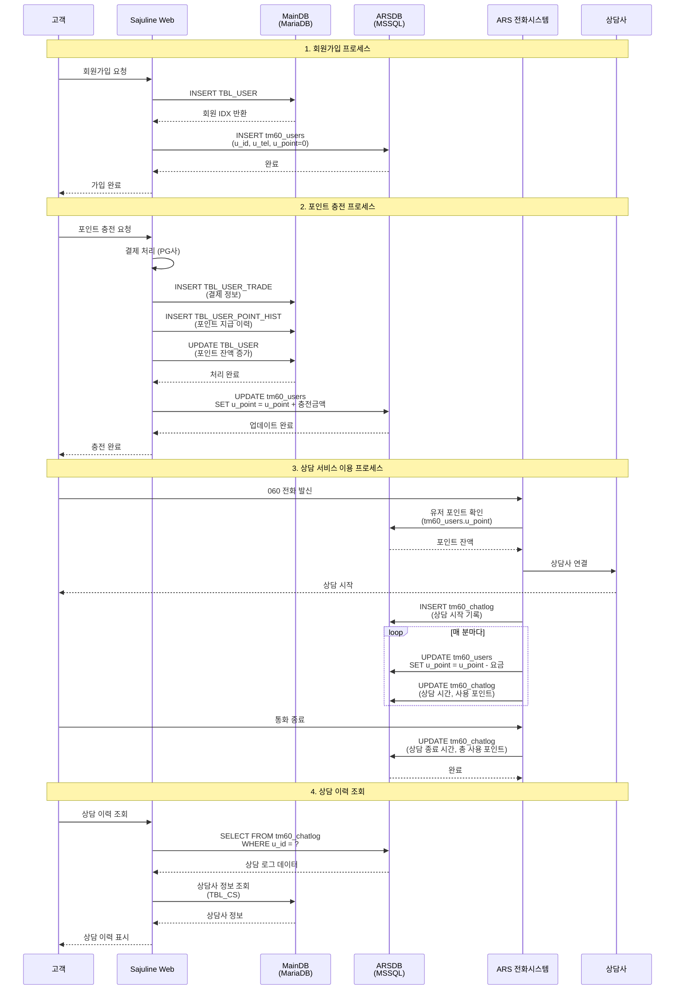

```mermaid
sequenceDiagram
    participant User as 고객
    participant Web as Sajuline Web
    participant MainDB as MainDB<br/>(MariaDB)
    participant ARSDB as ARSDB<br/>(MSSQL)
    participant ARS as ARS 전화시스템
    participant CS as 상담사
    
    Note over User,CS: 1. 회원가입 프로세스
    User->>Web: 회원가입 요청
    Web->>MainDB: INSERT TBL_USER
    MainDB-->>Web: 회원 IDX 반환
    Web->>ARSDB: INSERT tm60_users<br/>(u_id, u_tel, u_point=0)
    ARSDB-->>Web: 완료
    Web-->>User: 가입 완료
    
    Note over User,CS: 2. 포인트 충전 프로세스
    User->>Web: 포인트 충전 요청
    Web->>Web: 결제 처리 (PG사)
    Web->>MainDB: INSERT TBL_USER_TRADE<br/>(결제 정보)
    Web->>MainDB: INSERT TBL_USER_POINT_HIST<br/>(포인트 지급 이력)
    Web->>MainDB: UPDATE TBL_USER<br/>(포인트 잔액 증가)
    MainDB-->>Web: 처리 완료
    Web->>ARSDB: UPDATE tm60_users<br/>SET u_point = u_point + 충전금액
    ARSDB-->>Web: 업데이트 완료
    Web-->>User: 충전 완료
    
    Note over User,CS: 3. 상담 서비스 이용 프로세스
    User->>ARS: 060 전화 발신
    ARS->>ARSDB: 유저 포인트 확인<br/>(tm60_users.u_point)
    ARSDB-->>ARS: 포인트 잔액
    ARS->>CS: 상담사 연결
    CS-->>User: 상담 시작
    ARS->>ARSDB: INSERT tm60_chatlog<br/>(상담 시작 기록)
    
    loop 매 분마다
        ARS->>ARSDB: UPDATE tm60_users<br/>SET u_point = u_point - 요금
        ARS->>ARSDB: UPDATE tm60_chatlog<br/>(상담 시간, 사용 포인트)
    end
    
    User->>ARS: 통화 종료
    ARS->>ARSDB: UPDATE tm60_chatlog<br/>(상담 종료 시간, 총 사용 포인트)
    ARSDB-->>ARS: 완료
    
    Note over User,CS: 4. 상담 이력 조회
    User->>Web: 상담 이력 조회
    Web->>ARSDB: SELECT FROM tm60_chatlog<br/>WHERE u_id = ?
    ARSDB-->>Web: 상담 로그 데이터
    Web->>MainDB: 상담사 정보 조회<br/>(TBL_CS)
    MainDB-->>Web: 상담사 정보
    Web-->>User: 상담 이력 표시
```