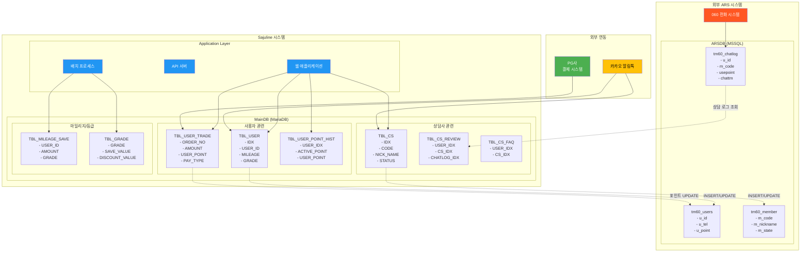

```mermaid
graph TB
    subgraph "Sajuline 시스템"
        subgraph "Application Layer"
            WEB[웹 애플리케이션]
            API[API 서버]
            BATCH[배치 프로세스]
        end
        
        subgraph "MainDB (MariaDB)"
            subgraph "사용자 관련"
                USER[TBL_USER<br/>- IDX<br/>- USER_ID<br/>- MILEAGE<br/>- GRADE]
                TRADE[TBL_USER_TRADE<br/>- ORDER_NO<br/>- AMOUNT<br/>- USER_POINT<br/>- PAY_TYPE]
                POINT[TBL_USER_POINT_HIST<br/>- USER_IDX<br/>- ACTIVE_POINT<br/>- USER_POINT]
            end
            
            subgraph "상담사 관련"
                COUNSEL[TBL_CS<br/>- IDX<br/>- CODE<br/>- NICK_NAME<br/>- STATUS]
                REVIEW[TBL_CS_REVIEW<br/>- USER_IDX<br/>- CS_IDX<br/>- CHATLOG_IDX]
                FAQ[TBL_CS_FAQ<br/>- USER_IDX<br/>- CS_IDX]
            end
            
            subgraph "마일리지/등급"
                MILEAGE[TBL_MILEAGE_SAVE<br/>- USER_ID<br/>- AMOUNT<br/>- GRADE]
                GRADE[TBL_GRADE<br/>- GRADE<br/>- SAVE_VALUE<br/>- DISCOUNT_VALUE]
            end
        end
    end
    
    subgraph "외부 ARS 시스템"
        PHONE[060 전화 시스템]
        
        subgraph "ARSDB (MSSQL)"
            AUSERS[tm60_users<br/>- u_id<br/>- u_tel<br/>- u_point]
            AMEMBER[tm60_member<br/>- m_code<br/>- m_nickname<br/>- m_state]
            ACHAT[tm60_chatlog<br/>- u_id<br/>- m_code<br/>- usepoint<br/>- chattm]
        end
    end
    
    subgraph "외부 연동"
        PG[PG사<br/>결제 시스템]
        KAKAO[카카오 알림톡]
    end
    
    %% 데이터 흐름
    WEB --> USER
    WEB --> TRADE
    WEB --> POINT
    WEB --> COUNSEL
    
    %% MainDB -> ARSDB 동기화
    USER -.->|INSERT/UPDATE| AUSERS
    COUNSEL -.->|INSERT/UPDATE| AMEMBER
    TRADE -.->|포인트 UPDATE| AUSERS
    
    %% 상담 프로세스
    PHONE --> ACHAT
    ACHAT -.->|상담 로그 조회| REVIEW
    
    %% 외부 연동
    PG --> TRADE
    KAKAO --> USER
    KAKAO --> COUNSEL
    
    %% 배치 프로세스
    BATCH --> GRADE
    BATCH --> MILEAGE
    
    style WEB fill:#2196F3,color:#fff
    style API fill:#2196F3,color:#fff
    style BATCH fill:#2196F3,color:#fff
    style PHONE fill:#FF5722,color:#fff
    style PG fill:#4CAF50,color:#fff
    style KAKAO fill:#FFC107,color:#000
```